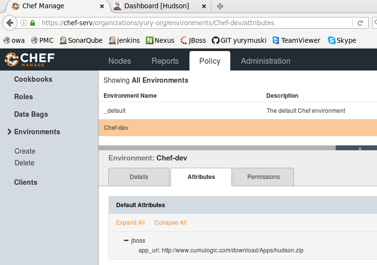
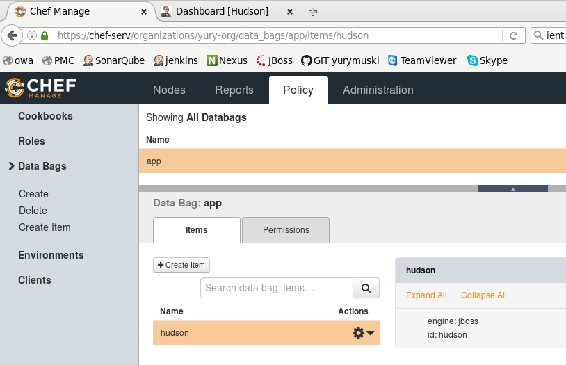
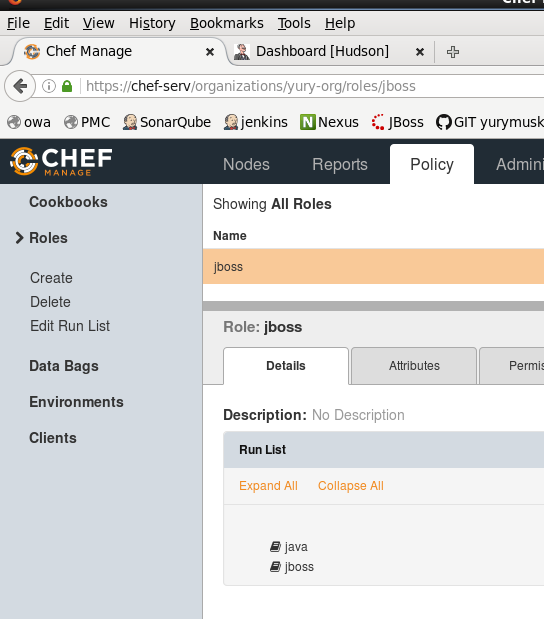
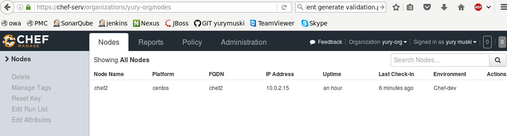
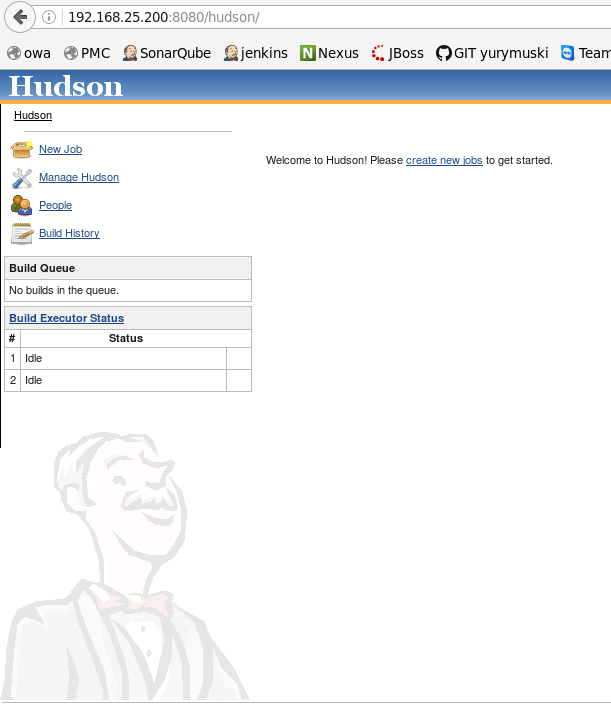

# chef_courses
  
ON SERVER  
installing chef server  
chef-server-ctl reconfigure  
  
chef-server-ctl reconfigure  
chef-server-ctl install chef-manage  
chef-server-ctl reconfigure  
chef-manage-ctl reconfigure  
chef-server-ctl user-create .... 
chef-server-ctl org-create  ....
  
  
ON HOST  
install chef client  
mkdir .chef  
[edit .chef/knife.rb](knife.rb)  
  
knife ssl fetch  
knife client list  
knife cookbook upload --all  
knife environment create Chef-dev -e nano
  
  
Create data bag "app"  
  
  
Create role with runlist  
  
  
knife cookbook upload --all  
sudo knife bootstrap 192.168.25.200 -N 'chef2' -x root -P vagrant -r 'role[jboss]' -E "Chef-dev" --sudo  
[output](output.txt)
  
  
