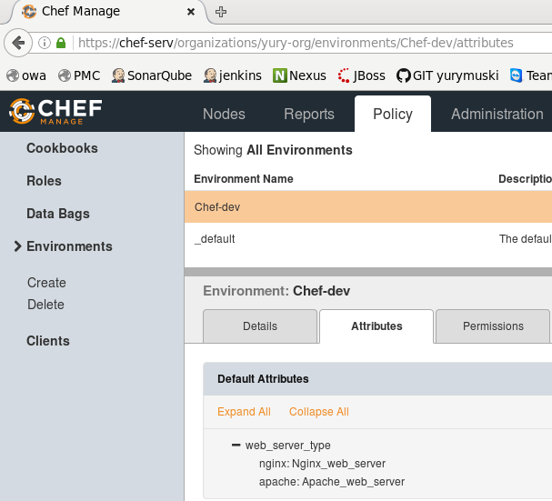
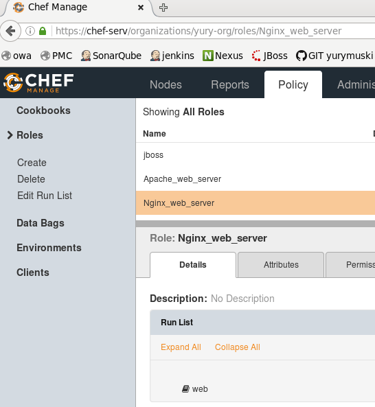
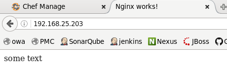
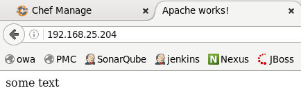

Created cookbooks and upload on server:  
Cookbook web:  
[/recipes/default.rb](cookbooks/web/recipes/default.rb)  
[/resources/default.rb](cookbooks/web/resources/default.rb)  
[metadata.rb](cookbooks/web/metadata.rb)  
  
Cookbook web_apache:  
[/providers/default.rb](cookbooks/web_apache/providers/default.rb)  
[/recipes/default.rb](cookbooks/web_apache/recipes/default.rb)  
[/templates/default/index.erb](cookbooks/web_apache/templates/default/index.erb)  
[metadata.rb](cookbooks/web_apache/metadata.rb)  
  
Cookbook web_nginx:  
[/providers/default.rb](cookbooks/web_nginx/providers/default.rb)  
[/recipes/default.rb](cookbooks/web_nginx/recipes/default.rb)  
[/templates/default/index.erb](cookbooks/web_nginx/templates/default/index.erb)  
[metadata.rb](cookbooks/web_nginx/metadata.rb)  
   
   
knife cookbook upload --all  
   
Edit environtment 
knife environment edit Chef-dev -e nano  
  
[env](environments/Chef-dev.json)  
  
  
  
knife role create Nginx_web_server -e nano  
  
[Nginx_web_server](roles/Nginx_web_server.json)  
  
knife role create Apache_web_server -e nano  
  
[Apache_web_server](roles/Apache_web_server.json)  
  
  
  
  
sudo knife bootstrap 192.168.25.203 -N 'chef3' -x root -P vagrant -r 'role[Nginx_web_server]' -E "Chef-dev" 
> [output_nginx.txt](output_nginx.txt)  
    
  
sudo knife bootstrap 192.168.25.204 -N 'chef4' -x root -P vagrant -r 'role[Apache_web_server]' -E "Chef-dev" 
> [output_apache.txt](output_apache.txt)  
  

  
Ex:  
role[Apache_web_server] => recipe web => "node.role?" checking role calling and getting from env variable => include_recipe 'web_apache' => doing actions => getting actions from web_apache providers  
