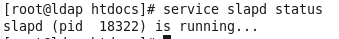
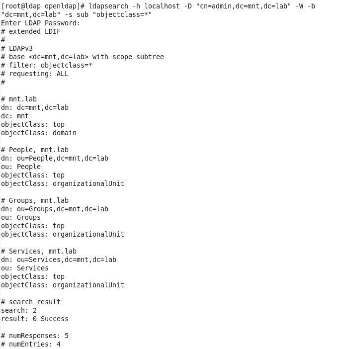
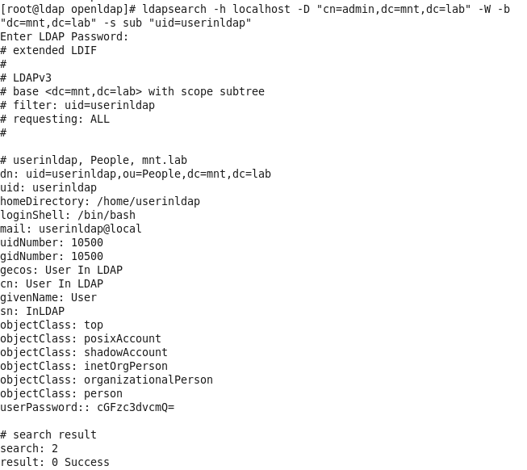
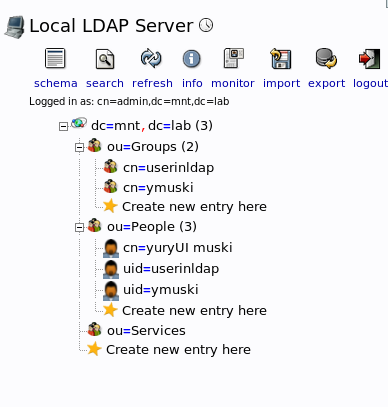
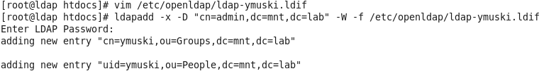
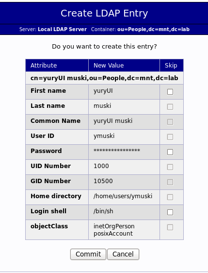

### Screenshot of slapd running process  
  

### Screenshot of successfully executed commands  
  
  
  
### Screenshot of phpLDAPadmin  
  
  
### Adding user by command 
 	
### Adding user in UI  
 

### [provision.yml](ldap/provision.yml)
### [LDAP role task](ldap/roles/ldap/tasks/main.yml)
### [phpadmin role task](ldap/roles/phpadmin/tasks/main.yml)
