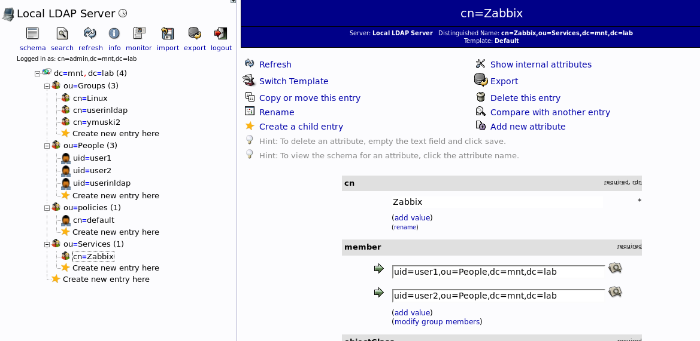

### Configure Audit logging  
- adding to /etc/openldap/slapd.conf  
  
moduleload auditlog.la  
overlay auditlog  
auditlog /var/log/ldap/audit.log  
(mkdir and chwon on /var/log/ldap/)  
  
  
### Configure Password Policy and memberof  
- adding to /etc/openldap/slapd.conf  
  
moduleload ppolicy.la  
  
overlay ppolicy  
ppolicy_default "cn=default,ou=policies,dc=mnt,dc=lab"  
ppolicy_use_lockout  
ppolicy_hash_cleartext  
  
moduleload memberof.la  
overlay memberof  
  
### Create group Linux and Zabbix. Add users into these groups.   
- Creating groups:  
[linux-gr.ldif](linux-gr.ldif)  
[zabbix-gr.ldif](zabbix-gr.ldif)  
  
- Creating users:  
[user1.ldif](user1.ldif)  
[user2.ldif](user2.ldif)  
ldapadd -x -D "cn=admin,dc=mnt,dc=lab" -W -f ./*.ldif  
  
- Seacrh:  
  
  
  
  
### on zabbix:  
yum install -y php-ldap  
service httpd restart  
  
Connect to Zabbix as Administrator  
Go to Administration - Users - Create user.   
On the tab  Permissions set   
User type = Zabbix Super Admin  
Click "Save"  
Logout  
Connect to Zabbix as newuser  
Go to Administration - Authentication - LDAP  
Password password_of_newuser_in_LDAP  
  
  
  
### on ldap-client:  
yum install -y openldap-clients nss-pam-ldapd pam_ldap nscd rpcbind authconfig  
  
vim /etc/nslcd.conf  
uri ldap://192.168.25.5/  
base dc=mnt,dc=lab  
ssl no  
tls_cacertdir /etc/openldap/cacerts  
filter passwd (&(objectClass=posixAccount)(memberOf=cn=Linux,ou=Groups,dc=mnt,dc=lab))  

authconfig --enableldap --enableldapauth --ldapserver=ldap://192.168.25.5/ --ldapbasedn=dc=mnt,dc=lab --disablefingerprint --kickstart --enablemkhomedir  
  
  
  
  

