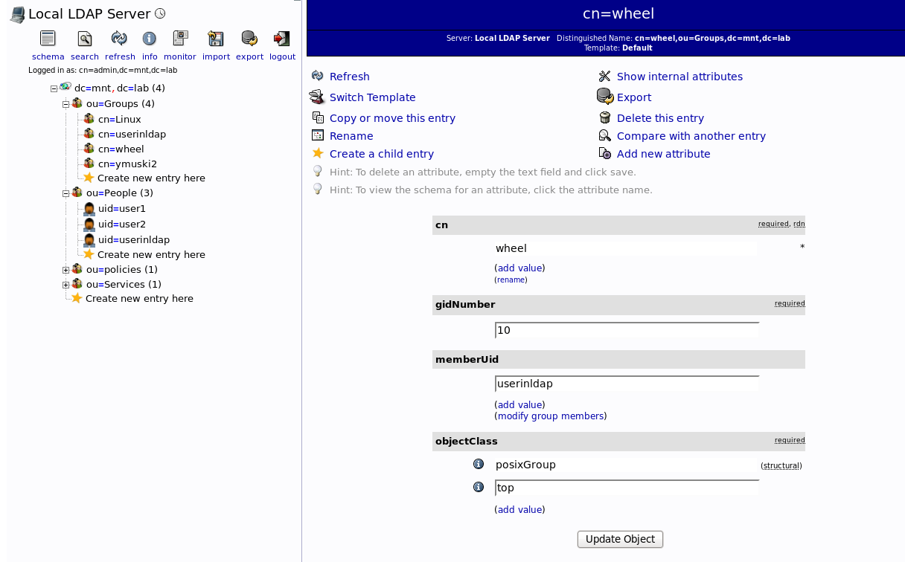
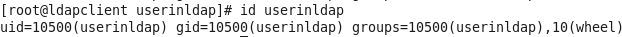
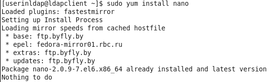
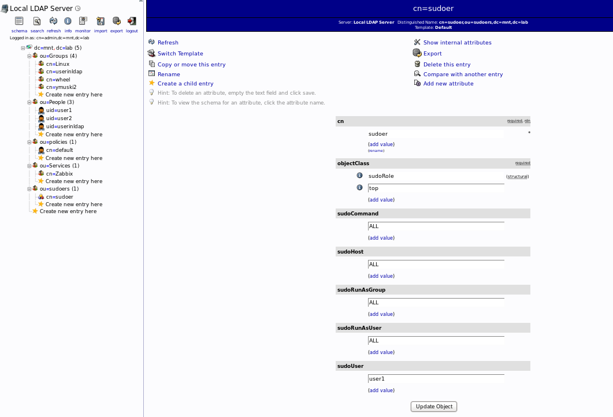
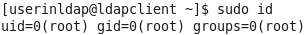
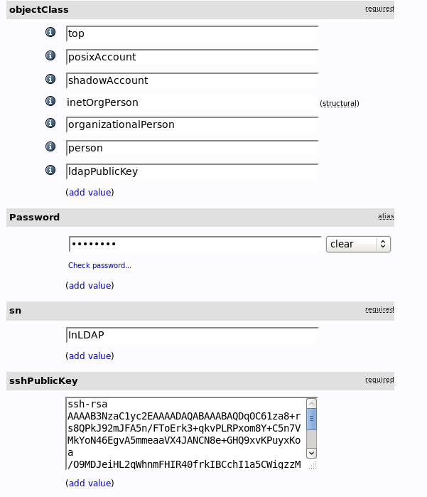
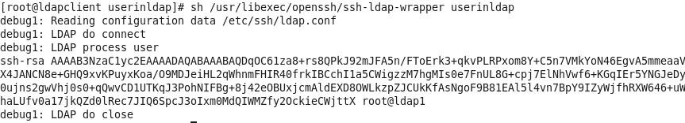
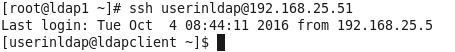

## Adding to sudoers using wheel:  
#### on server:  
- vim [wheel.ldif](wheel.ldif)  
- ldapadd -x -D "cn=admin,dc=mnt,dc=lab" -W -f ./wheel.ldif  
- service slapd restart  
  
#### on client:  
- echo '%wheel  ALL=(ALL)       ALL' > /etc/sudoers.d/wheel  
- chmod 0440 /etc/sudoers.d/wheel  
  
  
  
  
  
  
## Adding to sudoers OU  
#### on server:  
- vim /etc/openldap/slapd.conf  
  
*include         /usr/share/doc/sudo-1.8.6p7/schema.OpenLDAP*  
  
  
- slaptest -f /etc/openldap/slapd.conf  
- service slapd restart  
  
Creating “sudouers” organizational unit.  
Creating of SUDO Role in sudoers branch  
  
  
#### on client:  
- vim /etc/sudo-ldap.conf  
  
*binddn cn=admin,dc=mnt,dc=lab*  
*bindpw test*  
*uri ldap://192.168.25.5*  
*sudoers_base ou=sudoers,dc=mnt,dc=lab*  
  
  
- chmod 400 /etc/sudo-ldap.conf  
  
- vim /etc/nsswitch.conf  
  
*sudoers:    files ldap*  
  
  
  
## Adding key access:  
#### On server  
  
- yum install -y openssh-ldap nss-pam-ldapd  
- vim /etc/openldap/slapd.conf  
  
*include         /usr/share/doc/openssh-ldap-6.6.1p1/openssh-lpk-openldap.schema*  
  
- slaptest -f /etc/openldap/slapd.conf  
  
- service slapd restart  
  
- ssh-keygen  
  
- cat /root/.ssh/id_rsa.pub  
  
#### On web-IU  
  
adding public key to user  
  
  
  
#### On client  
  
- yum install -y openssh-ldap nss-pam-ldapd  
  
- vim /etc/ssh/sshd_config  
  
*PubkeyAuthentication yes*  
*AuthorizedKeysCommand /usr/libexec/openssh/ssh-ldap-wrapper*  
*AuthorizedKeysCommandRunAs nobody*  
  
- sshd -t  
  
- vim /usr/libexec/openssh/ssh-ldap-wrapper  
  
*#!/bin/sh*  
*exec /usr/libexec/openssh/ssh-ldap-helper -d -e -v -s "$1"*  
  
- chmod 755 /usr/libexec/openssh/ssh-ldap-wrapper  
  
- vim /etc/ssh/ldap.conf  
  
*ldap_version 3*  
*bind_policy soft*  
  
*binddn cn=admin,dc=mnt,dc=lab* -id  
*bindpw test* -pass  
  
*ssl no*  
*ssl start_tls*  
*tls_reqcert never*  
*tls_cacertdir /etc/openldap/cacerts*  
  
*host 192.168.25.5* -server ip  
*port 389*  
*base dc=mnt,dc=lab*  
  
  
  
- service sshd restart  
- sh /usr/libexec/openssh/ssh-ldap-wrapper username to check  
  
  
  
  
  
#### Extra sh getting last uid/gid   
ldapsearch -LLL -D cn=admin,dc=mnt,dc=lab -W -b "dc=mnt,dc=lab" gidNumber | grep 'uidNumber\|gidNumber' | awk 'BEGIN{max=0}{if ($2>max)max=$2}END{print max+1}'   
