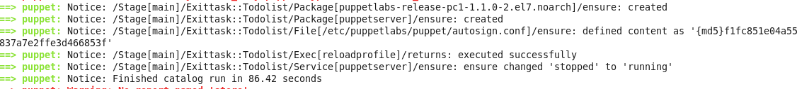
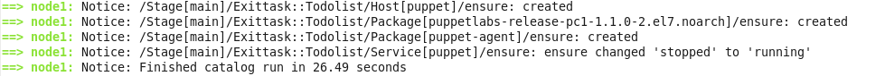
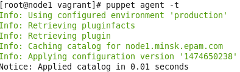
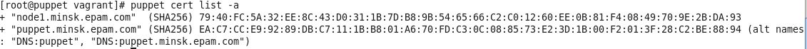

[Vagrantfile](Vagrantfile) creates 2 vm's and runs `puppet apply -e 'include exittask' --modulepath=/vagrant`

[manifests/init.pp](exittask/manifests/init.pp) includes [manifests/todolist.pp](exittask/manifests/todolist.pp)

Then [servercheck.rb](exittask/lib/facter/servercheck.rb) facter checks hostname and if true [manifests/todolist.pp](exittask/manifests/todolist.pp)

install puppet-server  
  
else puppet-agent.  
  
[template](exittask/templates/autosign.erb) adds facter domain to autosign.conf  
Checking on node   
  
Checking on server    
  
  
