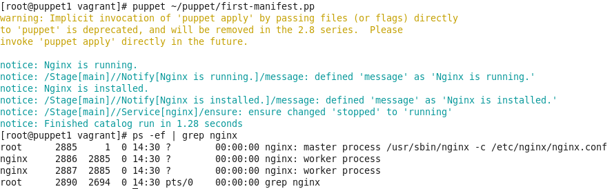

## task1:
Creating manifest:

Run&check:

  

## task2:

### On server:
`sudo rpm -Uvh https://yum.puppetlabs.com/puppetlabs-release-pc1-el-6.noarch.rpm`

`sudo yum install -y puppetserver`

puppet resource service puppetserver ensure=running

(`service puppetserver start`)

puppet resource service puppet ensure=running

(`service puppet start`)
  
### on client

`echo 192.168.25.100 servpuppet.local servpuppet puppet >> /etc/hosts`

`sudo rpm -Uvh https://yum.puppetlabs.com/puppetlabs-release-pc1-el-6.noarch.rpm`

`sudo yum install -y puppet-agent`

`service puppet start`

generates sign cert request on server if doesn't use:

`puppet agent -t --server chef-server.local --waitforcert 60 --test`

### On server:

Then we need to sign cert:

`puppet cert list`

`puppet cert sign puppet2.local`

check:

Installing module:

`puppet module install puppetlabs-ntp`

Creating manifest:

`nano /etc/puppetlabs/code/environments/production/manifests/task1.pp`

I tried two options:

[manifest-v1-.pp](task1.pp)  
[manifest-v2-.pp](task1v2.pp)  
  
### On client:

`puppet agent --server servpuppet.local -t`
