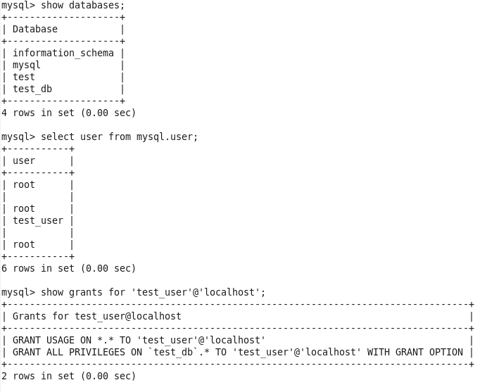

### On server

`puppet module install puppetlabs-mysql`

`nano /etc/puppetlabs/code/environments/production/manifests/site.pp`

`puppet parser validate /etc/puppetlabs/code/environments/production/manifests/site.pp`

[site.pp](site.pp)

### On client

`puppet agent --server servpuppet.local -t`
  
Checking mysql

