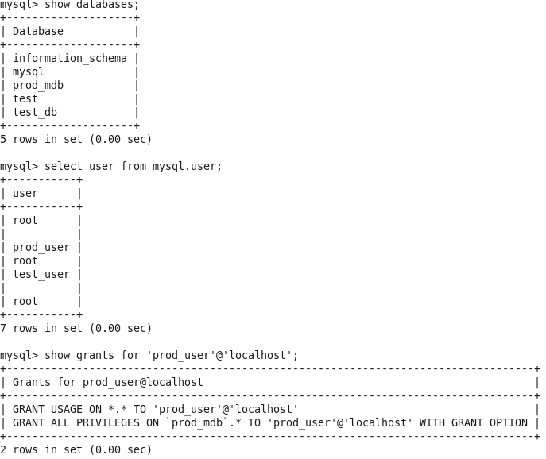
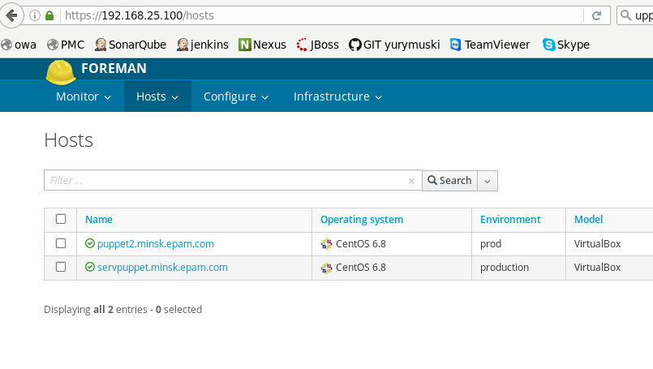

### On server

`rpm -ivh https://yum.puppetlabs.com puppetlabs-release-pc1-el-6.noarch.rpm`

`yum -y install epel-release https://yum.theforeman.org/releases/1.12/el6/x86_64/foreman-release.rpm`

`yum -y install foreman-installer`

foreman-installer

`puppet module install puppetlabs-mysql --environment prod`

`nano /etc/puppetlabs/code/environments/prod/manifests/site.pp`

[site.pp](site.pp)

### On client

`puppet agent --server servpuppet.local --environment prod -t`

