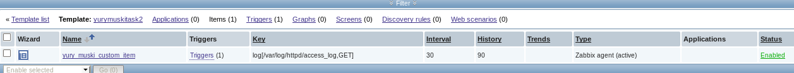
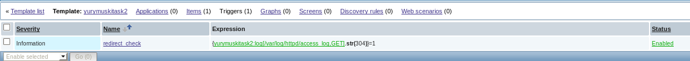
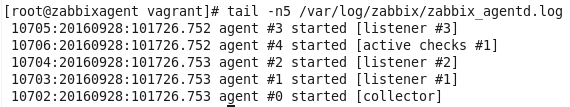
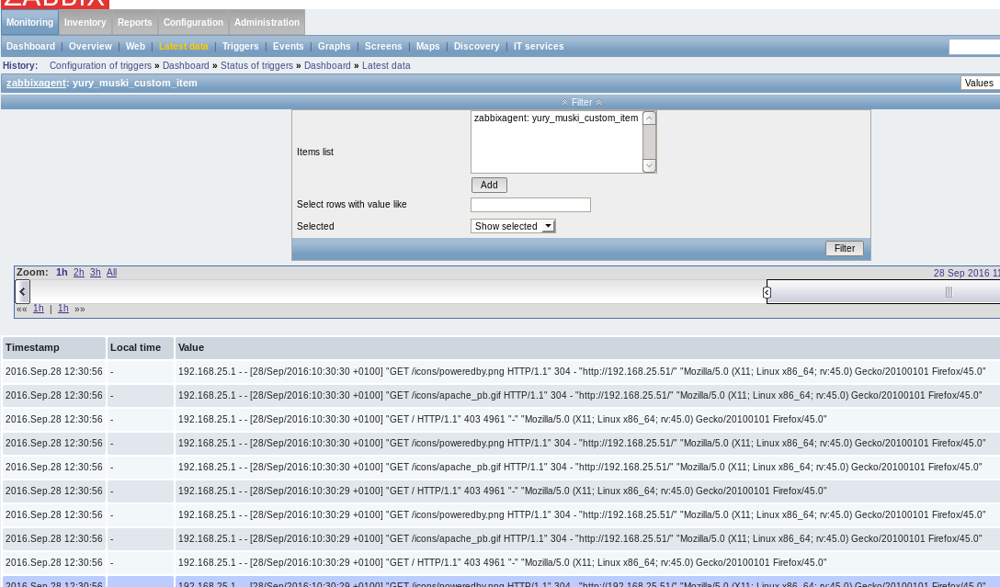
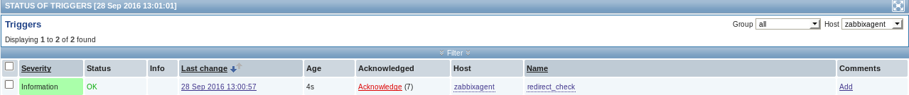
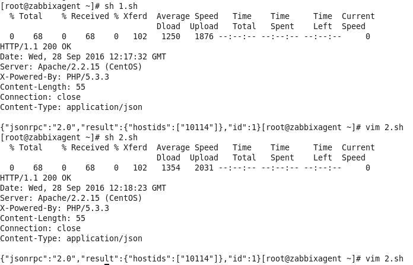
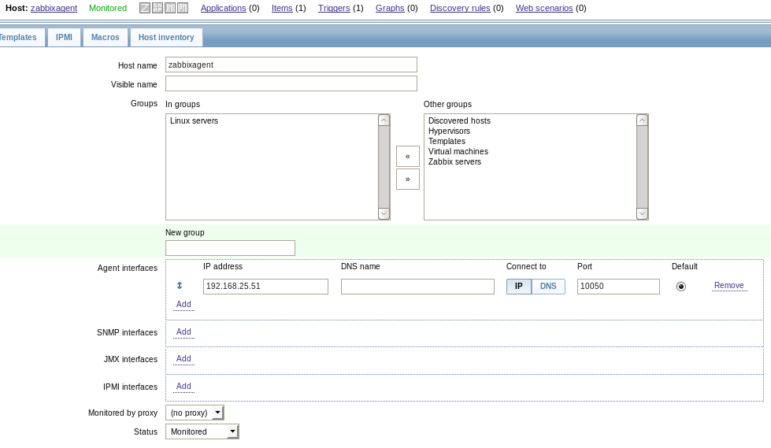
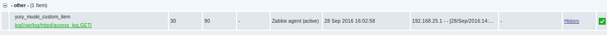
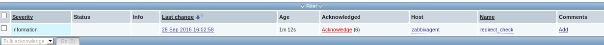

Creating template with custom item&trigger that read /var/log/httpd/access.log ad checks it for 304 response.  

For this we should create vm, add zabbix repo, install zabbix&zabbixx-agent, add to zabbix-agent.cong server's ip and agents name in zabbix system, add zabbix user to group root and chmod 774 on /var/log/httpd.
  
  
  
### zabbix agent log:  
  
  
### custom item reads log:  
  
  
### custom trigger works:  
  
  
  
### To register host method host.create with reqiered params [Script](1.sh) is used:  
### To update host method host.update with reqiered params [Script](2.sh) is used:  
  
  
  
  
  
  
  
  

	 	
	 	
	 	
	
