## 1) Creating Item with user param:  
- vim/etc/zabbix/zabbix_agentd.conf   
add:  
UserParameter=pid_tomcat,ps -ef|grep tomcat | awk '{print $2}'  
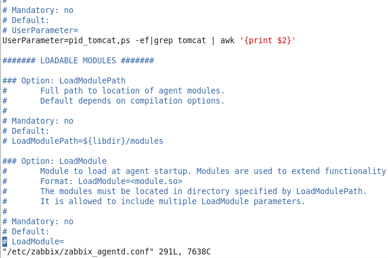  
creating item:  
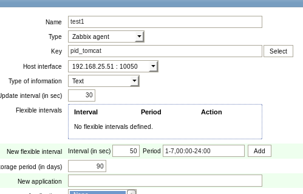  
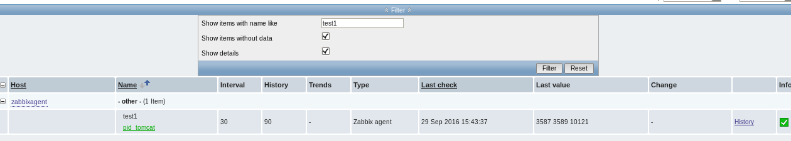  
  
  
## 2) Using externalscripts  
- cd /usr/lib/zabbix/externalscripts  
- vim [customscript.sh](customscript.sh)  
- chmod +x customscript.sh  
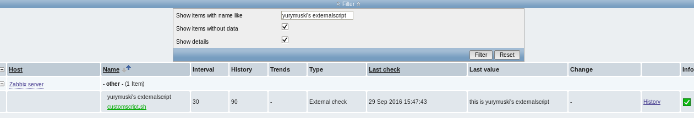  
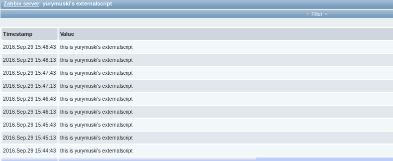  
  
## 3) Website monitoring  
create web scenario => steps => add url,response code, string  
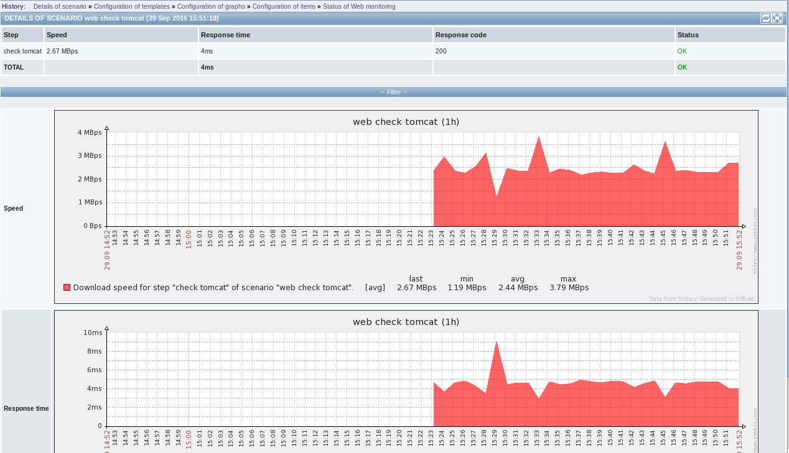  
  
  
## 4) Install Tomcat 7 and examine JMX parameters with JMX Gateway. (as example java.lang:type=Memory,HeapMemoryUsage.used etc.)  
  
### JMX configuration:  
##### on agent:  
- yum install -y java-1.7.0-openjdk.x86_64 tomcat tomcat-webapps  
- cd /usr/share/tomcat/lib  
- wget https://archive.apache.org/dist/tomcat/tomcat-7/v7.0.70/bin/extras/catalina-jmx-remote.jar  
  
- vim /usr/share/tomcat/conf/server.xml  
add:  
<Listener className="org.apache.catalina.mbeans.JmxRemoteLifecycleListener" rmiRegistryPortPlatform="12345" rmiServerPortPlatform="12346" />  
  
  
- vim $CATALINA_HOME/bin/catalina.sh or /usr/share/tomcat/conf/tomcat.conf  
add:  
JAVA_OPTS="${JAVA_OPTS} -Djava.rmi.server.hostname=192.168.25.51 -Dcom.sun.management.jmxremote -Dcom.sun.management.jmxremote.authenticate=false -Dcom.sun.management.jmxremote.ssl=false"  
192.168.25.51-external ip of agent  
  
- service tomcat start  
  
##### on webUI:  
  
- agents host edit:  
- add JMX interface  
- add templates: Template JMX Generic, Template JMX Tomcat  
  
  
##### on server:  
- yum install zabbix-java-gateway  
- vim /etc/zabbix/zabbix_server.conf  
  
add:  
JavaGateway=127.0.0.1  
JavaGatewayPort=10052  
StartJavaPollers=5  
  
  
- service zabbix-server restart  
- service zabbix-java-gateway start  
  
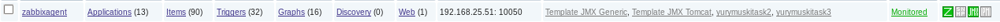  
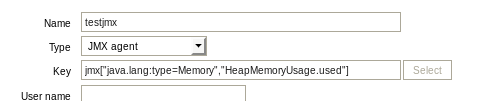  
  
Latest data  
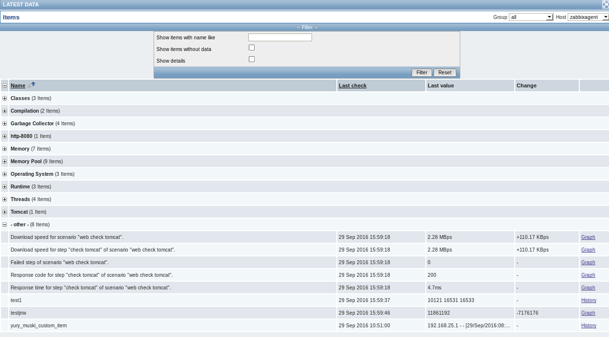  
  
## 5) Creating custom graph  
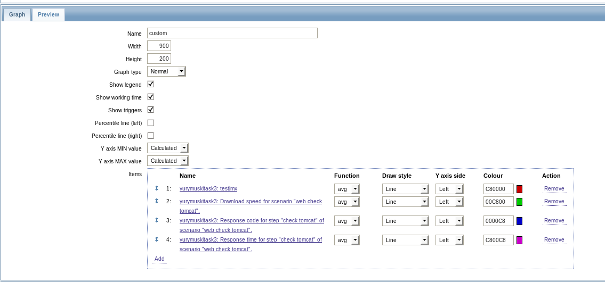  
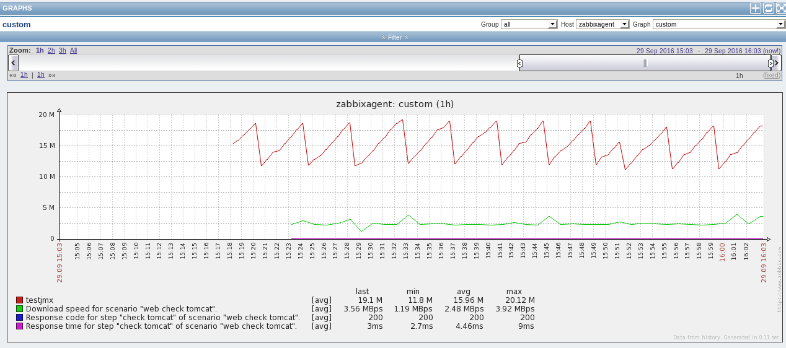  
  
## 6) Creating custom screen  
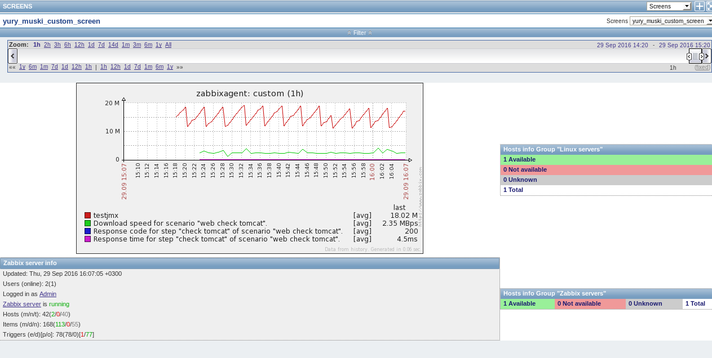  
  

